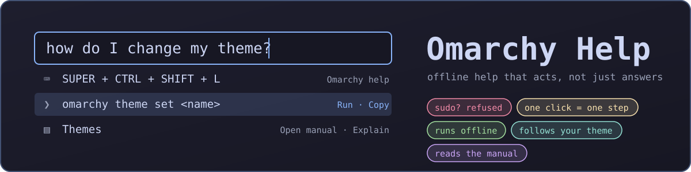
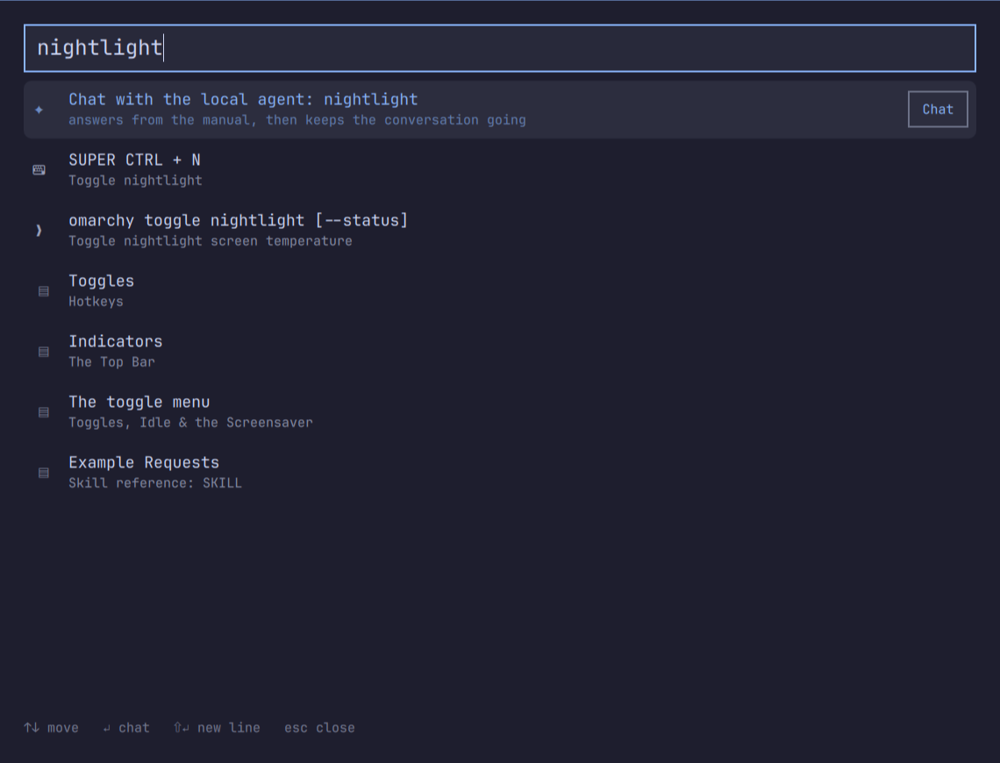
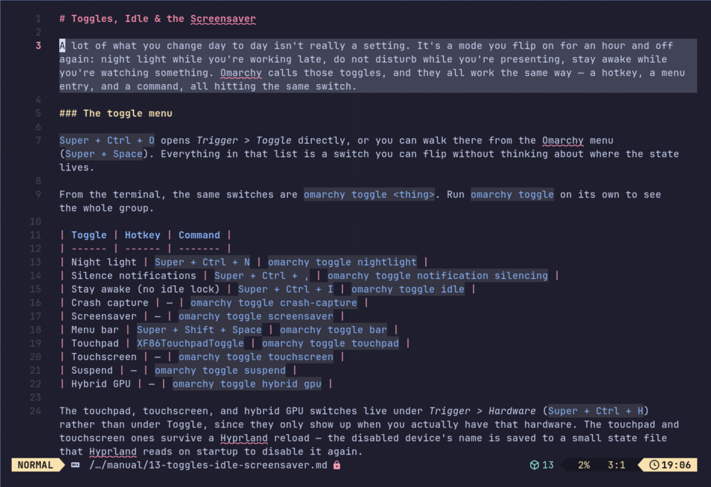
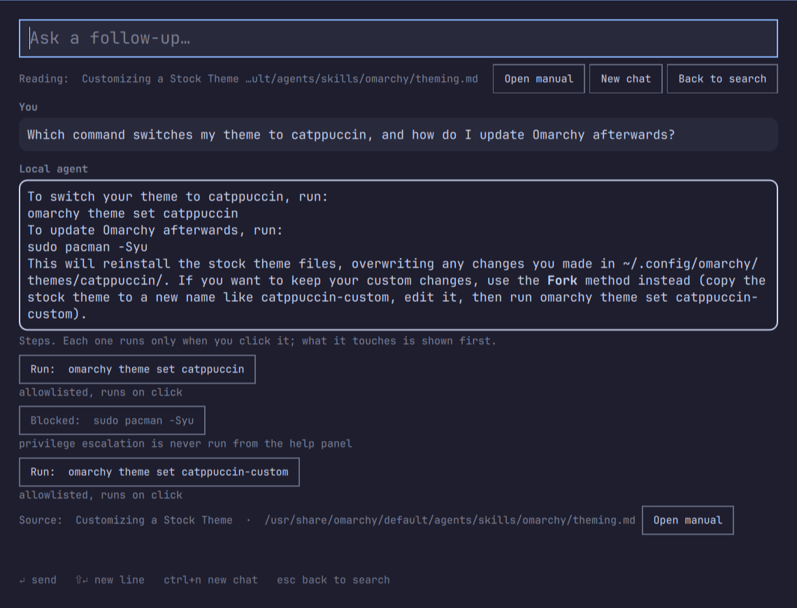
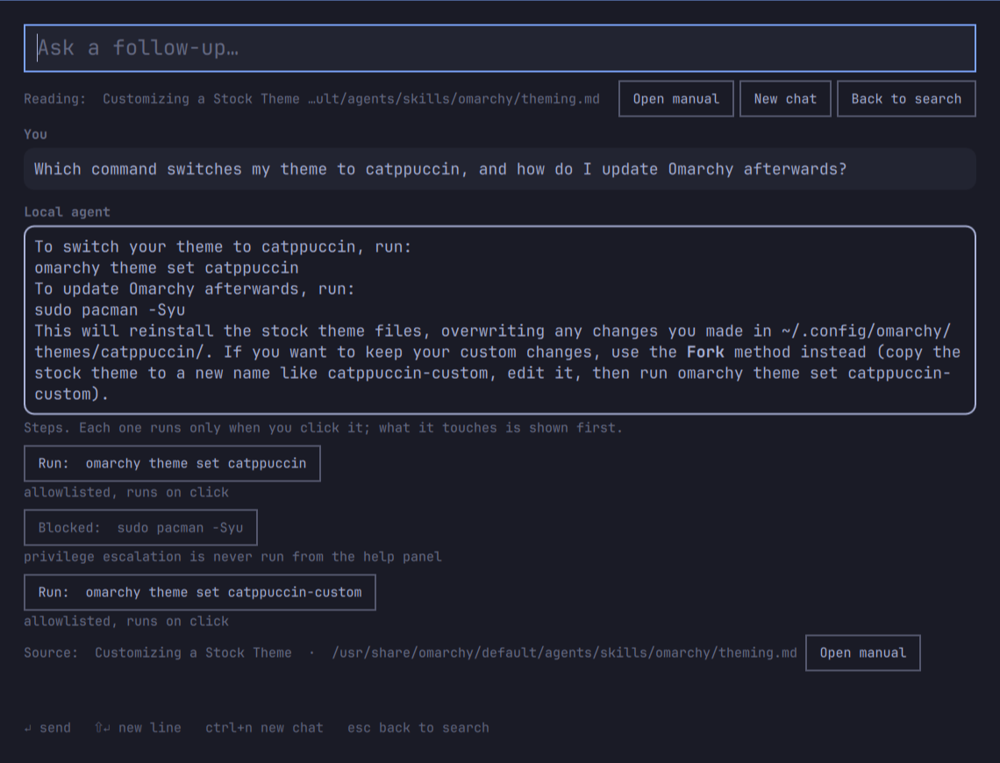
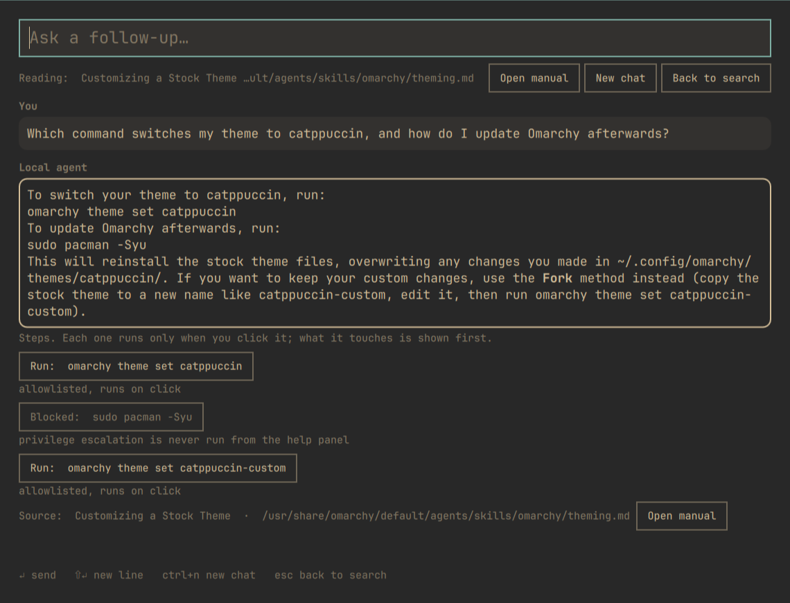
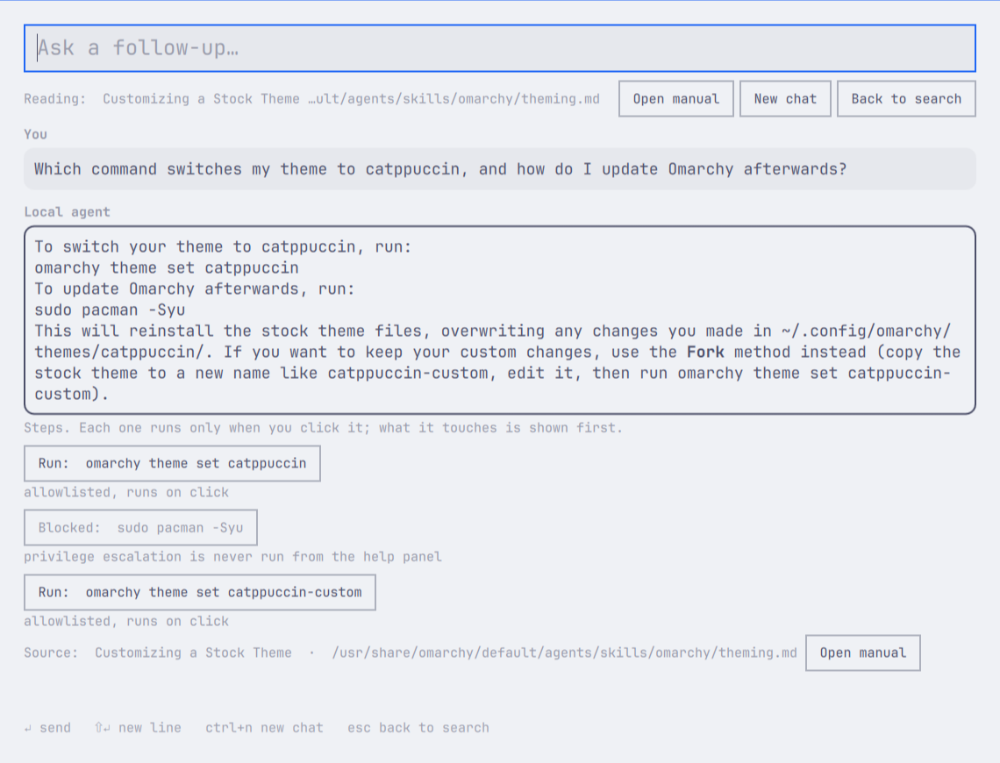

<p align="center">
  
</p>

<p align="center">
  <b>Offline help for <a href="https://omarchy.org">Omarchy</a> that acts, not just answers.</b><br>
  Search your keybindings, the <code>omarchy</code> CLI and the manual as you type. Run the command. Open the manual at the right heading.
  Chat with a model that lives on your own GPU. Nothing leaves your machine.
</p>

<p align="center">
  <code>omarchy plugin add https://github.com/modpunk/omarchy-help</code>
</p>

---

## What it does

### Search as you type



Press **SUPER + CTRL + SHIFT + L** (or click the bar button) and start typing.
Every keystroke searches three things at once, with no model and no network:

- **your live keybindings**, read from this machine, so a rebound key shows the
  binding you actually have;
- **the `omarchy` CLI**, every route with its arguments;
- **the manual for your installed version**, pinned to the matching git tag so
  it never describes a command you don't have.

Matches appear in about a millisecond. The input wraps to the window, so a long
question stays readable; Shift+Enter adds a line.

### Every result is something you can do

The selected row shows its actions as buttons, and the keys match:

| Row | Enter or click | Ctrl+Enter |
|-----|----------------|------------|
| ❯ command | **Run** it in a floating terminal | Copy |
| ▤ manual section | **Open the manual** at that heading | Explain |
| ⌨ keybinding | Copy | |
| ✦ your question | **Chat** with the local agent | |

The window is a normal floating window, not a popup. It stays on the workspace
while the terminal or the manual opens next to it, so you can keep going.

### Open the manual right there



Sections open read-only in Neovim, scrolled to the exact heading, in a floating
terminal beside the help window. The line is resolved with the same splitter the
index uses, so it lands on the heading every time (verified on all 272 sections).

### Chat with the local agent



Ask a question in your own words. The local model picks the manual section that
answers it, answers from that section and the matching keybinding and command
cards, and keeps the section pinned for follow-ups. Under every answer:

- the **source** with an *Open manual* button;
- the **steps** the answer proposes, one *Run* button each, with a caption that
  says what the command reads and writes and whether it is allowlisted;
- a placeholder like `<name>` is filled in from the conversation, and the
  resolved command is shown on the button before it can run.

The model is llama.cpp serving a 4B model on your GPU, bound to `127.0.0.1`,
under a hardened systemd user unit. The whole loop works with the network cable
unplugged. Search, run and open work even when the model is off.

### Run it, safely

Anything the panel executes goes through one policy, and you chose the model:
an **allowlist plus a click per step**, never a plain denylist.

- **Runs on click:** an `omarchy …` command the index knows, with plain
  arguments. Your click on that command is the confirmation.
- **Editable prompt first:** everything else, including commands with a
  placeholder and every non-omarchy command. Nothing runs until you press Enter
  in the terminal, and you can edit the line.
- **Refused, never run, never proposed:** `sudo`, `pkexec`, `doas`, recursive
  `rm`, `find -delete`, `shred`, `dd`, `mkfs`, power commands, system-level
  `systemctl`, recursive `chmod`/`chown` outside `$HOME`, piping anything into
  a shell or interpreter, interpreter one-liners (`sh -c`, `python -c`),
  `eval`/`exec`, fork bombs, reading `/etc/shadow`, and any write to `/usr`,
  `/etc`, `/boot`, `/dev`. A "run" verdict also requires an argument string
  with no shell syntax, so `;`, `&&`, `|`, `$(…)` and backticks behind an
  allowlisted prefix drop to the prompt.

What keeps this safe is the shape, not the pattern list: nothing runs without an
explicit click, one-click run is limited to indexed omarchy routes with plain
arguments, and everything else degrades to a prompt you read first. The refuse
list defends against model mistakes and foot-guns, not an adversary; a string
matcher over shell text cannot be complete, and there is no untrusted input
channel here. `omarchy-local-agent --check '<cmd>'` prints the verdict the panel
would apply.

### Follows your Omarchy theme

It draws with the shell's own menu tokens, so switching themes restyles it
instantly, light themes included.

| Tokyo Night | Gruvbox | Catppuccin Latte |
|:-:|:-:|:-:|
|  |  |  |

## Install

```sh
omarchy plugin add https://github.com/modpunk/omarchy-help
omarchy plugin enable io.github.modpunk.omarchy-help
~/.config/omarchy/plugins/io.github.modpunk.omarchy-help/install.sh   # asks first; CLI helpers, keybinding, float rule
omarchy-local-agent-index                                              # build the search index (fetches the manual for your version)
omarchy bar add io.github.modpunk.omarchy-help                         # optional bar button
```

`install.sh` shows what it will change and asks before touching anything
(`--yes` skips the prompt). It copies the two CLI helpers into `~/.local/bin`,
appends a marked SUPER + CTRL + SHIFT + L keybinding to `bindings.lua` and a
marked float rule to `looknfeel.lua` (backups kept beside them), installs the
post-update hook that rebuilds the index, and adds the llama-server user unit
and a config file only when none exist. Nothing else in your configuration is
modified.

### Dependencies

Search, run, and open need only what Omarchy ships: `python3`, `sqlite3`,
`nvim`, `wl-copy`, `omarchy-launch-tui`. Explain and chat additionally need:

- `llama-cpp` (Omarchy: `omarchy pkg add llama-cpp ggml-cpu ggml-cuda`, or the
  CPU build; the unit offloads to the GPU when one is present)
- a GGUF model in `~/.local/share/omarchy-local-agent/models/`. The default is
  Qwen3.8-4B-Distill Q4_K_M (2.6 GB, from
  [empero-ai/Qwen3.8-4B-Distill-GGUF](https://huggingface.co/empero-ai/Qwen3.8-4B-Distill-GGUF)):

  ```sh
  mkdir -p ~/.local/share/omarchy-local-agent/models && cd "$_"
  curl -fL --continue-at - -o Qwen3.8-4B-Distill-Q4_K_M.gguf \
    https://huggingface.co/empero-ai/Qwen3.8-4B-Distill-GGUF/resolve/main/Qwen3.8-4B-Q4_K_M.gguf
  systemctl --user enable --now omarchy-local-agent
  ```

  `tools/fetch-models.sh` fetches the whole bake-off set (22 GB) if you want to
  rerun `tools/bench.sh`. Downloads are plain files; nothing is executed.

The model runs on `127.0.0.1:8080` only and the unit is hardened
(`ProtectSystem=strict`, home read-only except its own data directory). No
network is used at query time; the indexer fetches the manual once from the
official Omarchy repository at your installed version's tag.

## Removal

```sh
~/.config/omarchy/plugins/io.github.modpunk.omarchy-help/uninstall.sh   # keybinding, rule, helpers, hook
omarchy plugin remove io.github.modpunk.omarchy-help
```

`uninstall.sh` removes only the marked lines and files it added and prints the
commands for the pieces it leaves alone (the service unit, the index and
models, the config file), so nothing large disappears without you asking.

## Keys

| Key | Search view | Chat view |
|-----|-------------|-----------|
| Enter | run command / open manual section / copy keybinding / start chat | send |
| Ctrl+Enter | copy command / explain section | |
| Shift+Enter | new line in the input | new line |
| Up / Down | move the selection | |
| Ctrl+N | | new chat |
| Esc | clear the query, then close | back to search |

## CLI

`omarchy-local-agent` answers on the command line too:

```sh
omarchy-local-agent "how do I change my theme"        # one answer
omarchy-local-agent --repl                            # interactive
omarchy-local-agent --open-section 06-themes#0        # open the manual there
omarchy-local-agent --run 'omarchy theme set <name>'  # terminal with the command on an editable prompt
omarchy-local-agent --check 'sudo pacman -Syu'        # policy verdict and read/write preview
```

`--search-daemon` and `--chat-daemon` are the JSON-lines interfaces the window
uses. Configuration lives in `~/.config/omarchy-local-agent/config.json`
(server URL, temperature, token and injection budgets).

## How it works

Two retrieval paths, chosen by what the question is. A "what's the key for X"
question is answered straight from the index by BM25 over the binds and
commands tables: sub-second, and it cannot hallucinate a keybinding that does
not exist on this machine. A "how do I" question goes through PageIndex: the
model reads a cached outline of the manual (numbered sections, so a small model
only has to emit an integer), names one section, gets that section verbatim, and
answers from it. The first call is nearly free because llama.cpp caches the
static prefix. Retrieval is guarded by a regression harness (`tools/eval.py`,
24/27 held-out cases) and the model choice by a bake-off (`tools/bench.sh`).

## Repository layout

| Path | What |
|------|------|
| `HelpPanel.qml`, `BarWidget.qml`, `manifest.json` | the plugin (a thin client over the CLI) |
| `bin/omarchy-local-agent` | search, chat, explain, open, run, policy |
| `bin/omarchy-local-agent-index` | builds the index; keeps the bind-count and corpus-collapse guards |
| `tools/eval.py` | retrieval regression harness: run after any change to retrieval, ranking, stopwords, weights or the outline; report the held-out number, never tune against it |
| `tools/bench.sh`, `tools/bench-results.txt` | the model bake-off (Qwen3.8-4B-Distill won) |
| `tools/fetch-models.sh` | downloads the bake-off models from Hugging Face (plain files) |
| `docs/local-agent.md` | the CLI's own design notes |
| `systemd/omarchy-local-agent.service` | llama-server user unit (GPU offload, hardened) |
| `hooks/refresh-agent-index` | post-update hook that rebuilds the index |
| `config.example.json` | tuned retrieval thresholds |
| `install.sh`, `uninstall.sh` | the pieces a plugin cannot ship; both marker-based, install asks first |

The manual is pinned to the installed Omarchy version's git tag on purpose; do
not point the indexer at master.

## License

MIT. Made for [omarchy.fans](https://omarchy.fans).
