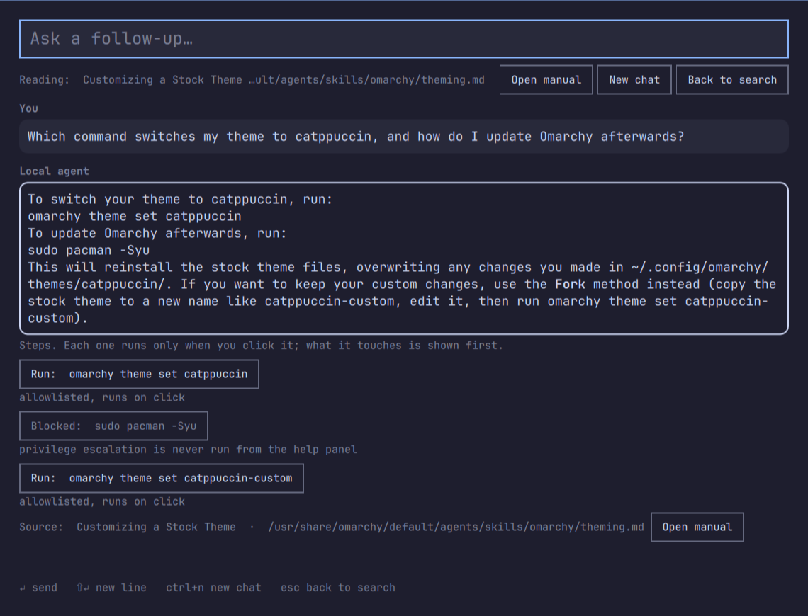

# Omarchy Help



Offline help for [Omarchy](https://omarchy.org), in a window that stays open
while you act on what it found. Plugin id `io.github.modpunk.omarchy-help`.

- **Search as you type** over this machine's live keybindings, the `omarchy`
  CLI, and the manual pinned to your installed version. No network, no model.
- **Run a command** from the results. It opens in a floating terminal on an
  editable prompt, so placeholders like `<name>` can be fixed before Enter.
- **Open the manual** at the matching section (read-only `nvim` in a floating
  terminal), or have the local model **explain** the section.
- **Chat with the local agent** about what to do. Answers stream from the
  llama.cpp server on your GPU (`omarchy-local-agent.service`), grounded in the
  manual section it picked, and follow-ups keep the conversation going.
- The input wraps to the window width, so long questions stay visible.
  Shift+Enter adds a line.

## Install

```sh
omarchy plugin add https://github.com/modpunk/omarchy-help
omarchy plugin enable io.github.modpunk.omarchy-help
~/.config/omarchy/plugins/io.github.modpunk.omarchy-help/install.sh   # asks first; CLI helpers, keybinding, float rule
omarchy-local-agent-index                                              # build the search index (fetches the manual for your version)
omarchy bar add io.github.modpunk.omarchy-help                         # optional bar button
```

`install.sh` shows what it will change and asks before touching anything
(`--yes` skips the prompt). It copies the two CLI helpers into `~/.local/bin`,
appends a marked SUPER + CTRL + SHIFT + L keybinding to `bindings.lua` and a
marked float rule to `looknfeel.lua` (backups kept beside them), installs the
post-update hook that rebuilds the index, and adds the llama-server user unit
and a config file only when none exist. Nothing else in your configuration is
modified.

### Dependencies

Search, run, and open need only what Omarchy ships: `python3`, `sqlite3`,
`nvim`, `wl-copy`, `omarchy-launch-tui`. Explain and chat additionally need:

- `llama-cpp` (Omarchy: `omarchy pkg add llama-cpp ggml-cpu ggml-cuda`, or the
  CPU build; the unit offloads to the GPU when one is present)
- a GGUF model in `~/.local/share/omarchy-local-agent/models/`. The default is
  Qwen3.8-4B-Distill Q4_K_M (2.6 GB, from
  [empero-ai/Qwen3.8-4B-Distill-GGUF](https://huggingface.co/empero-ai/Qwen3.8-4B-Distill-GGUF)):

  ```sh
  mkdir -p ~/.local/share/omarchy-local-agent/models && cd "$_"
  curl -fL --continue-at - -o Qwen3.8-4B-Distill-Q4_K_M.gguf \
    https://huggingface.co/empero-ai/Qwen3.8-4B-Distill-GGUF/resolve/main/Qwen3.8-4B-Q4_K_M.gguf
  systemctl --user enable --now omarchy-local-agent
  ```

  `tools/fetch-models.sh` fetches the whole bake-off set (22 GB) if you want to
  rerun `tools/bench.sh`. Downloads are plain files; nothing is executed.

The model runs on `127.0.0.1:8080` only and the unit is hardened
(`ProtectSystem=strict`, home read-only except its own data directory). No
network is used at query time; the indexer fetches the manual once from the
official Omarchy repository at your installed version's tag.

## Removal

```sh
~/.config/omarchy/plugins/io.github.modpunk.omarchy-help/uninstall.sh   # keybinding, rule, helpers, hook
omarchy plugin remove io.github.modpunk.omarchy-help
```

`uninstall.sh` removes only the marked lines and files it added and prints the
commands for the pieces it leaves alone (the service unit, the index and
models, the config file), so nothing large disappears without you asking.

## What can run from the panel

The user chose this model, and it applies to every execution path: an
**allowlist plus a confirmation per step**, never a plain denylist.

- **Run at once:** an `omarchy …` command the index knows, with no
  placeholder left. Your click on that specific command is the confirmation.
- **Editable prompt first:** anything else, including commands with a
  `<placeholder>` and every non-omarchy command. Nothing runs until you press
  Enter in the terminal.
- **Refused, never run and never proposed:** `sudo`, `pkexec`, `doas`,
  recursive `rm`, `find -delete`, `shred`, `dd`, `mkfs`, power commands,
  system-level `systemctl`, recursive `chmod`/`chown` outside `$HOME`, piping
  anything into a shell or interpreter, fork bombs, reading `/etc/shadow`, and
  any write to `/usr`, `/etc`, `/boot`, `/dev`. Writes only under `$HOME`.
  A "run" verdict also requires a plain argument string: any shell syntax
  (`;`, `&&`, `|`, `$(…)`, backticks, redirections) drops it to the prompt.

What keeps this safe is the shape, not the pattern list: nothing runs without
an explicit click; one-click run is limited to indexed omarchy routes with
plain arguments; everything else degrades to an editable prompt the user
reads first. The refuse list defends against model mistakes and foot-guns,
not against an adversary. A string matcher over shell text cannot be made
complete (any interpreter can destroy anything without naming a dangerous
command, which is why interpreters given `-c`/`-e` are refused outright), and
there is no untrusted input channel here: the model is local and the manual
is pinned to a tag of the official repository.

Chat answers list the commands they contain as separate "Run" buttons, one
click per step. Under each button the panel shows the verdict, what the
command reads and writes, and, when the model filled in a `<placeholder>`
from the conversation, the resolved command next to the template it came
from, so the path is visible before anything runs. Refused steps show as
blocked. `omarchy-local-agent --check '<cmd>'` prints the verdict and the
read/write preview the panel would apply.

## Keys

| Key | Search view | Chat view |
|-----|-------------|-----------|
| Enter | run command / explain section / copy keybinding / start chat | send |
| Ctrl+Enter | copy command / open manual section | |
| Shift+Enter | new line in the input | new line |
| Up / Down | move the selection | |
| Ctrl+N | | new chat |
| Esc | clear the query, then close | back to search |

Each selected row also shows its actions as buttons.

## CLI

`omarchy-local-agent` answers on the command line too:

```sh
omarchy-local-agent "how do I change my theme"     # one answer
omarchy-local-agent --repl                         # interactive
omarchy-local-agent --open-section 06-themes#0     # open the manual there
omarchy-local-agent --run 'omarchy theme set <name>'   # terminal with the command pre-filled
```

`--search-daemon` and `--chat-daemon` are the JSON-lines interfaces the window
uses. `--check CMD` prints the execution-policy verdict. Configuration lives in `~/.config/omarchy-local-agent/config.json`
(server URL, temperature, token and injection budgets).

## Repository layout

| Path | What |
|------|------|
| `HelpPanel.qml`, `BarWidget.qml`, `manifest.json` | the plugin (a thin client over the CLI) |
| `bin/omarchy-local-agent` | search, chat, explain, open, run, policy |
| `bin/omarchy-local-agent-index` | builds the index; keeps the bind-count and corpus-collapse guards |
| `tools/eval.py` | retrieval regression harness: run after any change to retrieval, ranking, stopwords, weights or the outline; report the held-out number, never tune against it |
| `tools/bench.sh`, `tools/bench-results.txt` | the model bake-off (Qwen3.8-4B-Distill won) |
| `tools/fetch-models.sh` | downloads the bake-off models from Hugging Face (plain files) |
| `install.sh`, `uninstall.sh` | the pieces a plugin cannot ship; both marker-based, install asks first |
| `docs/local-agent.md` | the CLI's own design notes |
| `systemd/omarchy-local-agent.service` | llama-server user unit (GPU offload, hardened) |
| `hooks/refresh-agent-index` | post-update hook that rebuilds the index |
| `config.example.json` | tuned retrieval thresholds |

The manual is pinned to the installed Omarchy version's git tag on purpose;
do not point the indexer at master.
